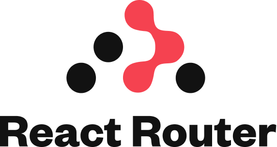
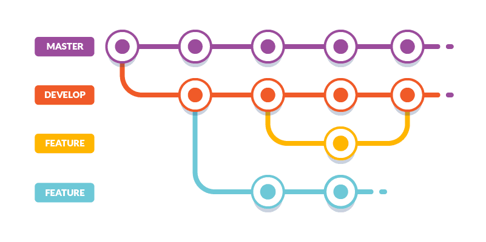

# Architecture

In the example of this challenge a simple application was made. In the case of a more robust application my proposal would be the following:

## Follow the Atomic Design Pattern

The structure of the project as well as in this challenge I suggest following the **Atomic Design** pattern as this is much more compatible when working with react projects. following these principles we can build by building our components by means of blocks, which, when combined, help promote consistency, modularity, and scalability of the application.

## State Management: Redux

Being a large application it is best to manage the status of the application with the help of **Redux** which helps us to maintain the reliability and consistency of the data. By using Redux the management of the application's information becomes more accessible from any point of the application, and if required, data persistence can be managed for a determined or undetermined period of time depending on the app's requirements and functions.

## Authentication

Being an app with more features it would be convenient that these features are controlled at user level so it would be necessary to perform an authentication to make use of them. For that we would have two options: to manage it with **Google authentication** or to **manage it internally in our backend**.
Once the authentication is done, the backend could return the necessary information from the user and a session could be managed, which could be stored in persistent Redux and be checking the expiration of the same or store it in the user's browser.

## Routing System

For the management of the routes will be necessary once you have the authentication based on the session you can make the management of public and protected routes using **React Router**, in this way would control the flow of the app and would prevent users from accessing pages that should not.

## API Integration

For the API integration I recommend following the same structure of this challenge, creating the functions of the basic **HTTP** **methods**: **GET**, **POST**, **PUT** and **DELETE**. Then the API functions are created using the base functions.
In case the data needs to be stored, it can be stored in redux for its use within the application (as in the example of this project) or they are handled as functions that are queried and can be called when necessary.
To these requests it will be necessary to pass a token which must be obtained and stored after authentication, this will help us to maintain security so that the user can only access and modify their information.

## Documentation

It is of vital importance to keep the functions documented preferably following the **JSDoc** standard so that any user viewing the code can understand what it does.

## Testing

In development, testing is of great importance as it ensures that components run and behave as expected in isolation. And it helps us reduce the probability of errors in production. I would recommend that in order to commit the changes, a **coverage** of at least 85-90% should be maintained with the promise of reaching a figure equal to or close to 100%.

## Git workflow

Being a large application, multiple people will work with the app code so it is necessary to keep track of the commits and branches of the project. I would recommend using the **Husky** tool which allows us to format and follow the conventions of commit messages, which makes the commits more understandable when reviewing them. In addition to the above Husky runs the tests before committing which ensures that what is committed is functional and does not contain errors.

## Cloud Services integration

For the integration with cloud services, I suggest the integration with **AWS**, so that the deployment can be done with the **S3** service for the storage of the project, which gives us greater scalability, data availability and performance. And the **CloudFront** service to streamline the distribution of the web application with higher speed and lower latency in data transfer.

